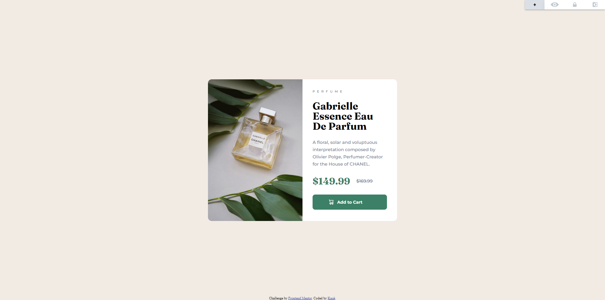

# Frontend Mentor - Product preview card component solution

This is a solution to the [Product preview card component challenge on Frontend Mentor](https://www.frontendmentor.io/challenges/product-preview-card-component-GO7UmttRfa). Frontend Mentor challenges help you improve your coding skills by building realistic projects. 

## Table of contents

  - [Screenshot](#screenshot)
  - [Links](#links)
  - [Built with](#built-with)
  - [Continued development](#continued-development)
  - [Author](#author)

### Screenshot

### Links

- Solution URL: [Add solution URL here](https://github.com/kauevecchia/product-preview-card)
- Live Site URL: [Add live site URL here](https://kauevecchia.github.io/product-preview-card)

### Built with

- HTML5
- CSS3
- Flexbox
- Media Queery

### Continued development

I want to continue practicing my css grid, flexbox, media query abilities

## Author

- Website - [Kauê](https://github.com/kauevecchia)
- Frontend Mentor - [@kauevecchia](https://www.frontendmentor.io/profile/kauevecchia)
